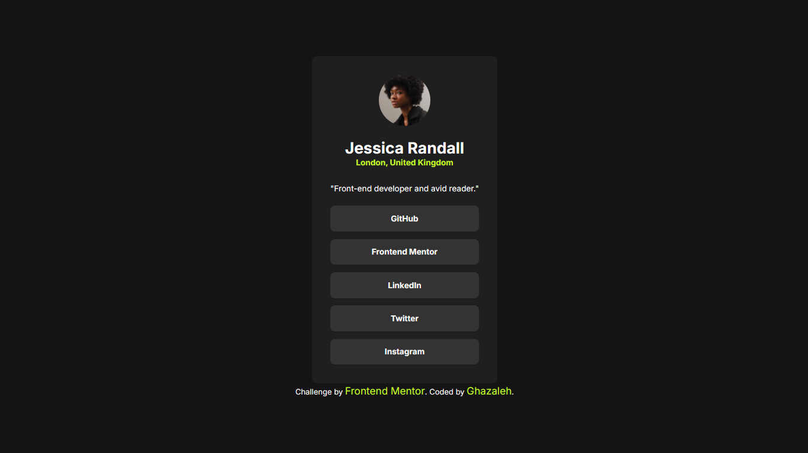

# Frontend Mentor - Social links profile solution

This is my solution to the [Social links profile challenge on Frontend Mentor](https://www.frontendmentor.io/challenges/social-links-profile-UG32l9m6dQ).

## Table of contents

- [Overview](#overview)
  - [Screenshot](#screenshot)
  - [Links](#links)

- [My process](#my-process)
  - [Built with](#built-with)
  - [What I learned](#what-i-learned)
  - [Continued development](#continued-development)
  - [AI Collaboration](#ai-collaboration)

- [Author](#author)

## Overview

This project is a responsive social links profile card built with semantic HTML and CSS as part of a Frontend Mentor challenge.

The main goal was to recreate the provided design while practicing semantic HTML, BEM-style class naming, local font loading, CSS custom properties, and interactive states.

### Screenshot



### Links

- Solution URL: [GitHub Repository](https://github.com/qzlenj/frontend-social-links)
- Live Site URL: [Live Site](YOUR-LIVE-SITE-URL)

## My process

### Built with

- Semantic HTML5 markup (`<main>`, `<article>`, `<nav>`, `<ul>`, `<footer>`)
- CSS custom properties
- Flexbox
- BEM naming methodology
- Local Inter font files in WOFF2 format
- Font preloading
- CSS transitions for interactive states

### What I learned

This project gave me more practice with semantic HTML and structuring a small component using meaningful elements instead of relying on generic `<div>` elements.

I used `<main>`, `<article>`, and `<nav>` to give the page a clearer structure, and added an accessible label to the navigation containing the social links.

I also continued practicing BEM-style naming to make the relationship between the card and its elements clear:

```html
<article class="card">
  
  <h1 class="card__username">Jessica Randall</h1>
  <p class="card__location">London, United Kingdom</p>
</article>
```

I also added hover states and CSS transitions to the social links to make the interaction feel smoother.

### Continued development

In future projects, I want to continue improving my understanding of:

- Mobile-first workflow
- Responsive layouts and sizing
- Accessibility and semantic HTML
- Keyboard focus states and accessible interactions
- Choosing the right CSS units for different situations
- Writing cleaner and more reusable CSS
- BEM naming and component structure

### AI Collaboration

I used ChatGPT as a learning and code-review partner during this project.

## Author

- GitHub - [@qzlenj](https://github.com/qzlenj)
- Frontend Mentor - [@qzlenj](https://www.frontendmentor.io/profile/qzlenj)
